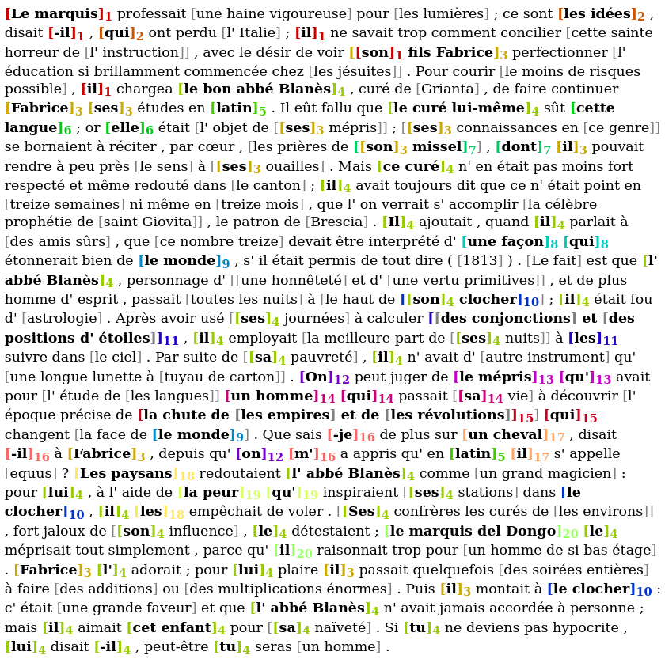

# coFR: COreference resolution tool For FRench


## Introduction

This repository contains an adaptation of the [Kantor and Globerson's coreference resolution tool](https://github.com/kkjawz/coref-ee) (described in Kantor and Globerson, 2019) to French.  The work is described in the following paper:

[Wilkens Rodrigo, Oberle Bruno, Landragin Frédéric, Todirascu Amalia (2020). **French coreference for spoken and written language**, _Proceedings of the 12th Edition of the Language Resources and Evaluation Conference (LREC 2020)_, Marseille, France](http://boberle.com/files/uploads/WilkensOberleLandraginTodirascu-2019_lrec.pdf).

For training and evaluation, we used two French corpora:

- Democrat (Landragin, 2016),
- Ancor (Muzerelle et al., 2014).

We converted the corpora into the `jsonlines` format used by the original system.  The Democrat corpus, originally composed of 10000-word-long chunks of longer texts has been split down to 2000-word-long documents.  We kept only the texts from the 19th century to the 20th century.  The Ancor corpus has been cut into thematic sections.  The corpus used are available for download below.

We have trained three models:

- `fr_mentcoref`: the model has been trained to detect mentions (all mentions, including singletons) and to resolve coreference,
- `fr_ment`: the model has been trained to detect mentions (all mentions) only,
- `fr_coref`: the model has been trained to resolve coreference only (oracle mentions are to be fed to the system in order to use this model).

We report the results of three experiments:

- using the model `fr_mentcoref`: this is the original end-to-end setup, in which one model both detects mentions and resolves coreference,
- using the model `fr_coref`: this is used to evaluate the coreference resolution task proper (as opposed to the combined two subtasks of mention detection and coreference resolution).  Oracle mentions are given to the system,
- using a sequence of two models: `fr_ment`, specialized for mention detection, and `fr_coref`, specialized for coreference resolution.

Features must be extracted before training or evaluating the model (this step is called `bertification` since it uses [BERT](https://github.com/google-research/bert) (Bidirectional Encoder Representations from Transformers)).  We tested two window sizes, the default one (511) and the one proposed by Kantor and Globerson (129).  The bigger window yields slightly better results, but the bertification process is longer (about 8x).  All our pretrained models use the bigger window size.


<table class="tg">
  <tr>
    <th class="tg-0lax"></th>
    <th class="tg-baqh" colspan="3">default window size (511)</th>
    <th class="tg-baqh" colspan="3">small window size (129)</th>
  </tr>
  <tr>
    <td class="tg-0pky"></td>
    <td class="tg-0pky">fr_mentcoref<br></td>
    <td class="tg-0pky">fr_coref</td>
    <td class="tg-fymr">fr_ment + fr_coref</td>
    <td class="tg-0pky">fr_mentcoref</td>
    <td class="tg-0lax">fr_coref</td>
    <td class="tg-0lax">fr_ment + fr_coref</td>
  </tr>
  <tr>
    <td class="tg-0pky">dem1921 (mention identification)</td>
    <td class="tg-0pky">76.36</td>
    <td class="tg-0pky">99.96</td>
    <td class="tg-fymr">88.95</td>
    <td class="tg-0pky">75.88</td>
    <td class="tg-0lax">99.96</td>
    <td class="tg-0lax">88.58</td>
  </tr>
  <tr>
    <td class="tg-0pky">dem1921 (conll f1)</td>
    <td class="tg-0pky">66.00</td>
    <td class="tg-0pky">85.04</td>
    <td class="tg-fymr">75.00</td>
    <td class="tg-0pky">65.38</td>
    <td class="tg-0lax">84.84</td>
    <td class="tg-0lax">74.97</td>
  </tr>
  <tr>
    <td class="tg-0pky">ancor (mention identification)</td>
    <td class="tg-0pky">52.75</td>
    <td class="tg-0pky">99.99</td>
    <td class="tg-fymr">88.06</td>
    <td class="tg-0pky">52.37</td>
    <td class="tg-0lax">99.99</td>
    <td class="tg-0lax">88.03</td>
  </tr>
  <tr>
    <td class="tg-0lax">ancor (conll f1)</td>
    <td class="tg-0lax">50.50</td>
    <td class="tg-0lax">88.75</td>
    <td class="tg-1wig">75.65</td>
    <td class="tg-0lax">50.48</td>
    <td class="tg-0lax">88.45</td>
    <td class="tg-0lax">75.47</td>
  </tr>
</table>


Note that these results include singleton mentions, which are available in both French corpora, but not in the standard corpus used for evaluation of English systems (OntoNotes/CoNLL 2012).

These scores were obtained with the official [scorer script](https://github.com/conll/reference-coreference-scorers) used for the CoNLL 2012 evaluation compaign.


References:
- Kantor and Globerson, 2019. "Coreference Resolution with Entity Equalization",
- Landragin, 2016. "Description, modélisation et détection automatique des chaı̂nes de référence (DEMOCRAT). Bulletin de l'Association Française pour l'Intelligence Artificielle.
- Muzerelle, Lefeuvre, Schang, Antoine Pelletier, Maurel, Eshkol and Villaneau 2014. ANCOR centre, a large free spoken french coreference corpus: description of the resource and reliability measures. In Proceedings of the 9th Language Resources and Evaluation Conference (LREC'2014).


## Getting started

First install the library requirements.  By default, we use `tensorflow-gpu`.  Install `tensorflow` if you want to use your CPU.

```bash
pip3 install -r requirements.txt
```

Examples below use Democrat.  If you prefer to train and evaluate with Ancor, use the `setup_{corpus,models}_ancor.sh` scripts and adapt the `experiments.conf` configuration file (search for `ancor` and `democrat` and comment/uncomment parameters according to your corpus).


### Evaluating

To reproduce our results, please run the following commands:

```
bash -x -e setup_all.sh
bash -x -e setup_corpus_dem1921.sh
bash -x -e setup_models_dem1921.sh
bash -x -e extract_bert_features.sh test.french.jsonlines evaluate
python3 evaluate.py fr_ment,fr_coref test.french.jsonlines output.jsonlines
```

This will download the corpus and our pretrained models.  For more information on the corpora we used for training, see [here](https://github.com/boberle/coreference_databases).

Note that the longest part is the bertification and should be done with a GPU.  As said before, you can reduce the window size to 129.  This would yield slightly lower results but will dramatically decrease the bertification time.

Also note that this is not the official evaluation from the `scorer.pl` script used for the CoNLL-2012 evaluation campaign.  For that, you need to convert the `output.jsonlines` file to the CoNLL format and to use the [scorer script](https://github.com/conll/reference-coreference-scorers).

To convert to CoNLL, please see [these scripts](https://github.com/boberle/corefconversion).


### Training

To train new models, please run the following commands:

```
bash -x -e setup_all.sh
bash -x -e setup_corpus_dem1921.sh
bash -x -e setup_training.sh
python3 train.py train_fr_ment
python3 train.py train_fr_coref
```

The training corpora are available [here](https://github.com/boberle/coreference_databases).


### Predicting

First, you will need to download [BERT Multilingual](https://github.com/google-research/bert):

```
wget https://storage.googleapis.com/bert_models/2018_11_23/multi_cased_L-12_H-768_A-12.zip
unzip multi_cased_L-12_H-768_A-12.zip
rm multi_cased_L-12_H-768_A-12.zip
```

To make predictions with our pretrained models, you will need to convert your corpus in the `jsonlines` format (see use [these scripts](https://github.com/boberle/corefconversion) or the `detail_instructions.md` file).  For a demo, you can use one the document of the Democrat corpus:


```
bash -x -e setup_all.sh
bash -x -e setup_models_dem1921.sh
bash -x -e setup_corpus_dem1921.sh
head -n 5 test.french.jsonlines | shuf | head -n 1 > myfile.jsonlines
python3 predict.py fr_ment,fr_coref myfile.jsonlines mypredictions.jsonlines
```

To convert to the text or CoNLL formats, please see [these
scripts](https://github.com/boberle/corefconversion).  You may also want
to import the annotated text into a software such as
[TXM](http://textometrie.ens-lyon.fr/) for exploitation. Please see
[this script](https://github.com/boberle/jsonlines2tei) to learn how to
do this.


## Example

Here is an example.  This is an except from the _Chartreuse de Parme_ (Stendhal), from [Wikisource](https%3A%2F%2Ffr.wikisource.org%2Fwiki%2FLa_Chartreuse_de_Parme_%28%25C3%25A9dition_Martineau%2C_1927%29).  This text is **NOT** part of the Democrat corpus, so it was totally unseen during the development and the training phases:




## Going further

See the `detail_instructions.md` file for more information.


## Other Quirks

* It does not use GPUs by default. Instead, it looks for the `GPU` environment variable, which the code treats as shorthand for `CUDA_VISIBLE_DEVICES`.

## License

This work is published under the terms of the Apache 2.0 licence.  See the `LICENSE` file for more information.


## Acknowledgments

This work has been developped within the [Democrat project](https://anr.fr/Projet-ANR-15-CE38-0008) (DEscription et MOdélisation des Chaînes de Référence: outils pour l'Annotation de corpus (en diachronie et en langues comparées) et le Traitement automatique) and the [Alector project](https://anr.fr/Projet-ANR-16-CE28-0005) (Aide à la lecture pour enfants dyslexiques et faibles lecteurs), from the French National Research Agency (ANR) (ANR-16-CE28-0005 and ANR-15-CE38-0008, respectively).


